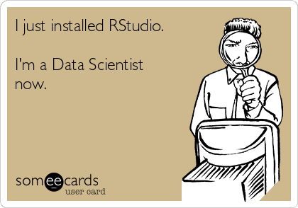
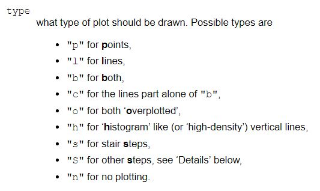
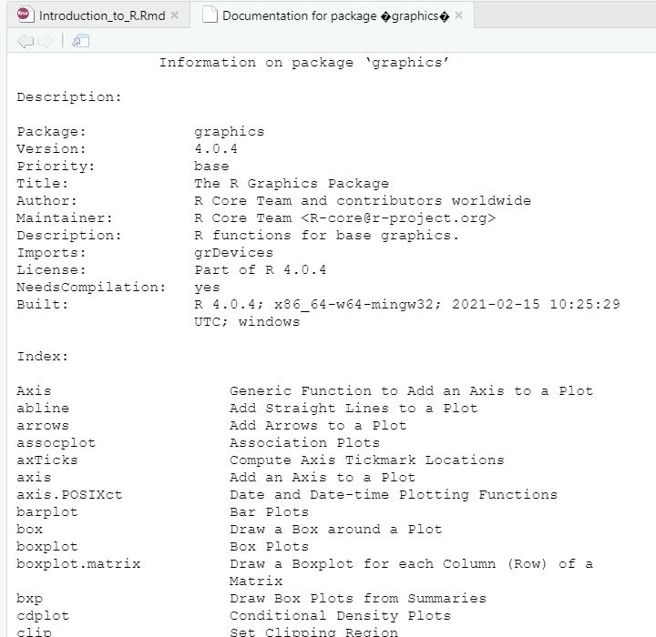

```{r setup, include=FALSE}
library(learnr)
knitr::opts_chunk$set(echo = FALSE)
tutorial_options(exercise.completion = FALSE)

vec1 <- c(1,2,3,4)

vec2 <- c("dog", "cat", "pet", "bird")

vec3 <- c(vec1, vec2)

A <- matrix(2, nrow = 3, ncol = 3)

B <- matrix(c(1,2,7,5,11,17), nrow = 2, ncol = 3, byrow = TRUE)

M_column <- cbind(vec1, vec2)

M_row <- rbind(vec1, vec2)

example_data <- data.frame(ID_num = c(1:10),
                           Age = rep(24:28, each = 2),
                           State = c(rep("New Jersey", 5), rep("New York", 5)))

rownames(example_data) <- c("Sarah", "Mike", "Drew", "Eric", "Maria", "Lindsey", "Mark", 
                            "Jenny", "Sophie", "Paul")

fake <- sample(c("strongly disagree", "disagree", "no opinon", "agree", "strongly agree"), size=100, replace=TRUE)

example_list <- list(vec1, vec2, vec3, A, B, M_column, M_row, example_data)

C <- matrix(c(12,15,27,50), nrow = 2, ncol = 2)

D <- matrix(seq(1,20), nrow = 10, ncol = 2)

fake_data <- sample(c(1,2,3,4,5), size=100, replace=TRUE, prob=c(.2,.3,.1,.3,.2))

cc_app_function <- function(creditscore) { 

    # If the credit score is less than 500, the credit card is not approved
    if (creditscore < 500){
    creditcard = "not approved"
    
    } else if(creditscore < 700) { # otherwise if it is less than 700...
      creditcard = "approved (credit limit $2000)"
      
    } else { # otherwise...
      creditcard = "approved (credit limit $10,000)"
    }
  
  return(creditcard) # this tells R that the function will return the value of "creditcard"
}

cc_app_function2 <- function(creditscore, stamp=FALSE) { 
  
  #first check if the application has a stamp of approval
  #note: we also could have just written "stamp" in the conditional 
  #because "stamp" and "stamp==TRUE" both evaluate to the whether or not stamp is true.
  if(stamp==TRUE){
    creditcard = "approved (credit limit $10,000)"
  } 
  
  else { #Otherwise (i.e., if stamp==FALSE)...
    # If the credit score is less than 500, the credit card is not approved
    if (creditscore < 500){
    creditcard = "not approved"
    
    } else if(creditscore < 700) { # otherwise if it is less than 700...
      creditcard = "approved (credit limit $2000)"
      
    } else { # otherwise...
      creditcard = "approved (credit limit $10,000)"
    }
  }
  
  return(creditcard) # this tells R that the function will return the value of "creditcard"
}

#Set seed to get always the same result. 
set.seed(333)

#take a sample of 10 random credit scores and approval stamps
creditscores <- sample(seq(300, 850, by=1), size = 10, replace=TRUE) 
stamps <- sample(c(TRUE, FALSE), size=10, replace=TRUE)  

#create a data frame called data
data <- data.frame(score=creditscores, stamp=stamps)

library(carData)

data(TitanicSurvival)

mean_age <- mean(TitanicSurvival$age, na.rm=TRUE) #mean

oldest_age <- max(TitanicSurvival$age, na.rm=TRUE) #min

youngest_age <- min(TitanicSurvival$age, na.rm=TRUE) #max

survival <- TitanicSurvival[1:50,c("survived", "age")]

height_sex.csv <- "https://raw.githubusercontent.com/Jaz-T/Welcomepackage/main/height_sex.csv"
height <- read.csv(height_sex.csv)

t <- 0.5

zoo = "zooming"

sex <- c("Female", "Male", "Male", "Male", "Female", "Female", "Male", "Female", "Female", "Male")

library(tidyverse)
library(ggplot2)

game <- function(numbers){
  card <- sample(1:10, size=1)
  
  
  if(card==numbers[1]|card==numbers[2]|card==numbers[3]){ #check if you won
  #another option: if(card %in% numbers)
    
    result <- "You won!"
    
  } else {
    
    result <- "You lost"
    
  }
  
  return(result)
}

```


## What is R?

R is a language and environment for statistical computing and graphics. There are a lot of commands, functions and packages that could help you perform different calculations and analysis. But before you jump into them, it is important to learn how to make your own code and learn the basic structures and functions. You could always go to R-project (https://www.r-project.org/about.html) to get more details and information. 

The purpose of this shiny app is to give you a foundation of how this language works and some of the basic commands. You can practice in the shiny app and we encourage you to download the program and explore more. In order to download the program and get familiar with the interface please refer to the Software_Installation document (There is one for PC and one for MAC). We recommend you to watch this video to get a general overview of the functionality of this program (https://www.youtube.com/watch?v=Sze9mhGv11A). We will cover some of this material in the app but the video is a better visualization of how everything should look in your desktop.

### What if I have never programmed in my life? 

Hey do not worry! We all have been there at some point. We will try to explain everything in detail and if you have any question do not hesitate in contacting us. We will do our best to solve your questions or find an appropriate resources. Before we start, just think that programming is imputing information and expecting to retrieve some result. Here, you will learn how to communicate with the program to obtain the results you want. 

{width=110%, height=105%}


## Getting started with R

When learning a new software or program it is always useful to familiarize with the interface and the basic "lingo" used for the program. This section will give you an overview of this.

First things first! Maybe right now you are wondering if R is the same as RStudio or what is the difference between them. Well, R is the basic software, meaning it is the language itself. While RStudio is the interface that makes the software looks "prettier". You could use R without RStudio but not the other way around. As a beginner, probably is easier to start using RStudio because of the visualization.  


### Description of R studio

Through this app we will be talking as if you where in RStudio. So, we hope by now you already have your program open to better follow this description. When you first open the program, you will see the screen divided in four windows. You can make them bigger or smaller and change the order according to your preferences! (Many things in R can be set or written according to your preference and style).

{width=700px, height=350px}


Also notice that the file open is a ".R" file. There are three basic types of documents that you can create ".R", ".Rmd", and ".Rproj". In the shiny app we will focus in the ".R" files. This type of files are use to write mainly code with a few written notes. ".Rmd" files can store more text and are used when you want to "knit" your file as a ".pdf" or "HTML" format. You can see more information about the ".Rmd" files in the cheat sheets. Only know, that by "knitting" we mean you will be able to render your document to a more "professional" looking one. (We highly recommend ask and search for more resources about this, since most of your assignments will be done in this format). Finally, the projects files in R store a group of information that is useful when you want to share information. You will see more about them in your "Data Science for Social Impact" course.


Okay, back to the four windows! (We will enumerate the windows as in the image before, but notice that they might be in a different order in your screen). In the first window you will see something similar to a "BlocNote". This space is the file itself and you can save it as you would any document (file/save as/name.R). The file is designed to write and store your code in it. The second window is the console, here is where the code actually runs. Every command that has been given and executed to the software will be written there. You can also write directly in the console but it will not be saved unless is written in the file.


The third window contains your environment. Here you will temporarily (as long as you have them save) store all your variables and objects. It is a good practice to clean it every time you are running a new  file. Lastly, there is a window with your "Files", "Plots", "Packages", "Help" and "Viewer". Let's focus on "Help" (we will see the others along the other sections). "Help" will allow you to search information about a command or package. There it is a space where you can type what you are looking for or in the console you can type in `?"topic_name"` (i.e. `?c`). Where "topic_name" is the name of what you are looking for. This will give you a manual of what it is and how to use it. 

{width=200px, height=200px}


### R "lingo"

Maybe we have mentioned some concepts that you have no idea what we are talking about or you might have a clue but you are not sure. We will focus on that here. What is an object, a command or a package? Don't be overwhelmed by these terms! We will try to explain them all. 


An object or variable in R can be a single number or text, or a group of them. Later we will discuss the group structures (Basic structures in R). Let's focus on the single numbers or text. When we want to store these objects in our environment, we need to "name" them. In order to do so,  you can use "<-" or "=" (it depends on your personal style). This is important because giving them a name will allow you to call them later on. Run the code below. Note that when we want to add text, we need to put it in quotations marks (" "). Additionally, it will seem that nothing is happening. But by doing this we will be storing this variables in our environment. This will be more clear to you, if you run this code in your Rstudio. 

```{r naming, exercise=TRUE}
t <- 0.5
```

```{r naming2, exercise=TRUE}
zoo = "zooming"
```

If you are wondering what "call them" means. It means to type the name again. If you do so, you will notice that R will give you back the number or text that you named. 

```{r namingb, exercise=TRUE}
t
```

```{r naming2b, exercise=TRUE}
zoo
```

Do you feel that you can create a variable named A3SR with the text "I am excited to start the program!"? Try it! If you feel stuck try using the hints.

```{r A3SR-name, exercise=TRUE}

```

```{r A3SR-name-hint}
# Remember to put the whole text between the same quotation marks. 
```

```{r A3SR-name-solution}
A3SR <- "I am excited to start the program!"
#OR
A3SR = "I am excited to start the program!"

A3SR #To check the variable is giving you back the text. 
```


If you used the hints, you have noticed that we used "#" before the text. Pound sign is used to indicate R that what you are writing is a comment and nothing should be executed. These comments are used as a good practice to remember what you did or let other people know what you did. In this context, run or execute means that you have written the command and give it to R in order to receive some result. There are several ways to do this. In the shiny app, you are pressing the button "run". In your R file there is also a "run" button. If you are typing the commands in the file, you can also use your keyboard to run them (ctrl + enter). And if you are typing in the console, just press enter and it will be execute. 

Now let's explain command or function. These are the "orders" or "questions" that we are giving R in order to receive some result. Is our way of communication with the software. We have seen one function which is naming. This is the way we ask R to remember something. But there are others that are pre-loaded, we will see some of them in the next sections. What you need to know so far, is that they have some name and we set some arguments in parenthesis (name(argument1 = x, argument2 = y )). The arguments are the extra information we provide R about the command that we are asking. Imagine you want one soda but not any soda, you want a coke with ice. If R was a waiter you will specify something like: 
soda(n = 1, type = "coke", ice = TRUE). Soda is the command because is the final result you want, and the arguments are the specifications of the soda that you want. Too bad we cannot ask sodas to R! But we hope you get the idea of how this works. Also note that the way of saying "yes" in R is "TRUE" and "no" is "FALSE".

Lastly, "packages" are a group of functions that other people have created. They make our life easier but we need to learn to do ours too! We will go more in detail in the "Using packages" section. Note that even when we are using the basic ones here, there are plenty more! Some of them you will learn them in your courses and some through your own research. In some case you can use Google to find them and learn how to use them. Just be careful with the resources you decide to use. 

{width=200px, height=200px}


## Basic structures in R

R uses vectors to process the information (even when using a scalar it is defined as a vector of 1x1). There are four basic forms in which they can be represented: **vector**, **matrix**, **data frame**, and **list**. Refreshing your linear algebra knowledge will become handy! But don't worry we also have a small review here that you can complement with the math review in the welcome pack.

### Vectors

A vector is defined as a sequence of data elements of the same basic type. It is important to know that in R we can create numeric vectors and text vectors and that there are different ways to create them. The easiest way to create a vector is using c( ) function. Remember that using help can give you more information about the commands (we saw how to do it in the previous section `?c`). Basically this command concatenates elements that you enlisted. If you go to the help file you will see that the first argument of this command is "...". We know that this does not provide a lot of information. In this case means that you can enlist numbers, text or words, so that they can be presented as a vector. Usually, when we use this command this is the only argument we need to worry about. Run the commands bellow and see how they work:

```{r c-command, exercise=TRUE}
c(7, 24, 15, 3, 1, 9)
```

You can see in the result that the numbers become a string. Now they are a vector. Now let's try naming a couple of vectors. Remember that in the App you cannot see what is happening. But if you run it in your Rstudio, you will see this objects are store in your environment. 

```{r c1-command, exercise=TRUE}
vec1 <- c(1,2,3,4)
```

```{r c2-command, exercise=TRUE}
vec2 = c("dog", "cat", "pet", "bird")
```

Now let's call the vectors we have created. Remember that in order to do this we can write the name that we gave them and run the command. If you were running this in R, you will see the command and the result below in the console. However in the app you will see two lines of results below. The first one is for vec1 and the second for vec2.

```{r call-command, exercise=TRUE}
vec1
vec2
```

In order to know which structure of information we are working with, we can always use the class( ) command. However, when working with vectors it will only tell us if they are "numeric" or "character", which is the type of information that they contain. Run the code below.

```{r class-command, exercise=TRUE}
class(vec1)
class(vec2)
```

Try combining numbers and text in one vector and see what happens to the class type:

```{r ccomb-command, exercise=TRUE}

```

```{r ccomb-command-hint}
# Follow the structure of the previous vectors.
```

```{r ccomb-command-solution}
vec3 <- c(1, 2, 3, 4, "dog", "cat", "pet", "bird") #you can add the list again
vec3 <- c(vec1, vec2) #or you can add the vector you have created. 
vec3
class(vec3)
```

As we saw at the beginning of this section, vectors can only contain one type of data. That is why even when there are numbers in "vec3", R transform it to a character vector. In other words the numbers are now text. Also notice that we can run different commands in different lines. If we wanted to run in the same line, we would need to separate the commands with ";". Try running the next code:

```{r ccomb-extra, exercise=TRUE}
vec3; class(vec3)
```


There are some other ways to create vectors such as rep( ), which repeats values and seq( ), that generates a sequence of values. Run the code below and see the result:

```{r rep-command, exercise=TRUE}
rep(x = 0, times = 5)

rep(x = c(1,5,7), each = 3, times = 5)
```

As you saw, you can repeat only one value or a set of values using c( ) command. 

```{r seq-command, exercise=TRUE}
seq(from = 1, to = 5, by = 0.5)

seq(from = 1, to = 5, length.out = 17)
```

Can you see what `length.out` is doing? It is setting the jumps between numbers such that the resulting vector has 17 elements going from 1 to 5. 


#### Factor variables and levels

A special case of vectors are factor variables. This type of vectors usually include categorical data. Do you remember the difference between categorical and numerical data? Numeric data expresses information in the form of numbers. Categorical variables can also be express as numbers but also text. This is because categorical data is used to group information with similar characteristics. There are two types of categorical data: unordered and ordered. Unordered data means that it does not matter which one comes first or second. This is because the order does not have any meaning. Could you think examples of this? Maybe the most obvious are sex and race. In the next example we will create a vector with sex and then use the command factor( ) to transform it into a categorical variable.

```{r cat-un-variables, exercise=TRUE}
# Create a vector that contains the sex for 10 persons. 

sex <- c("Female", "Male", "Male", "Male", "Female", "Female", "Male", "Female", "Female", "Male")

#Transform variable into categorical variable.

factor(sex)

```

In the result you will see that there is the text "Levels: Female Male". This means that the vector is identifying two groups. R by default will order the levels by alphabetical order. In this case this order does not have any meaning, so there is no need to modify it. You will need to name this variable if you want to save the new vector:

```{r cat-un2-variables, exercise=TRUE}
#Name the new variable

sex.cat <- factor(sex)

#Call the new variable

sex.cat

```

Now let's talk about the ordered categorical variables. Suppose you collect some data were you asked people to rate their agreement with the statement, "I like coffee." Each person responds on a scale from 1-5 where 1=strongly disagree, 2=disagree, 3=no opinion, 4=agree, and 5=strongly agree. When you collect this data, you might want the numerical responses to be linked with their descriptions. Also, you probably don't want R to treat this as a continuous variable when you run a model (because a value of 2.3 is not possible). The codes below shows an example of this. A vector with fake data (called fake) has been pre-loaded: 


```{r factor-or-variables, exercise=TRUE}
# Print the first 10 elements of the vector
fake[1:10]

# Make fake into a factor variable
fake <- factor(fake)

# Look at the first 3 elements of the fake data
fake[1:3]
```

Notice that when you see the levels, R has ordered them in alphabetical order. In this case, we would like to see the order as described before. In order to do this, we will need to add an extra argument to the factor command called level:

```{r factor-or2-variables, exercise=TRUE}

# Make fake into a factor variable with specific levels
fake <- factor(fake, levels = c("strongly disagree", "disagree", "no opinion", "agree", "strongly agree"))

# Look at the first 3 elements of the fake data

fake[1:3]
```

Now you can see that the levels are ordered by the level of agreement. There is one extra command if you want to indicate that one is better than two and so on. To do this, you can use the ordered( ). See the example below:

```{r factor-or3-variables, exercise=TRUE}

# Make fake into a factor variable with ordered levels
fake <- ordered(fake, levels = c("strongly disagree", "disagree", "no opinion", "agree", "strongly agree"))

# Look at the first 3 elements of the fake data

fake[1:3]
```


### Matrix

A matrix is an arrangement of vectors. The vectors could be arrange by column or by row. There are different ways to create matrices, and the easiest one is with matrix( ) command. Run the code below and try to think what is this command doing. 

```{r matrix-command, exercise=TRUE}
A <- matrix(2, nrow = 3, ncol = 3)

B <- matrix(c(1,2,7,5,11,17), nrow = 2, ncol = 3, byrow = TRUE)

print(A)

print(B)
```


In matrix A you can see that the matrix created has 3 columns and 3 rows (To refresh your memory, we can call this a 3 x 3 matrix). Since we are only specifying the number 2 as a value, the command is repeating this value in three rows and columns. 


Do you feel that you can explain what matrix B is doing? In this case, we are giving 6 values and asking R to order them in 2 rows and 3 columns. If we specify `byrow = TRUE`,  R will fill first a row with the numbers and after is complete will continue with the next row. What is the size of this matrix? If your answer is 2 x 3, it is correct! From your linear algebra courses, you now that we specify first the number of rows and then the number of columns. 


As we mentioned before, a matrix is an arrangement of vectors, so it will make sense that we could merge different vectors into a matrix. To do this, we could use cbind( ) or rbind( ) command. Could you guess what is the difference? Run the code below to find the difference:


```{r cbind-rbind-command, exercise=TRUE}
M_column <- cbind(vec1, vec2)
M_row <- rbind(vec1, vec2)

M_column
M_row

class(M_column)
class(M_row)
```


### Data frames

Data frames are generally used to store tabular data and are composed of same-length vectors; these vectors can be of different data types. In general, when you read a .csv data file into R, it will be saved as a data frame. Can you see a main difference between data frames and matrix? If you are thinking about the data type, you are correct! Matrix as vectors can only store the same type of data. If they are different,  they will be transformed to the same type. Remember the code you wrote in the vectors section! 

Even when data frames are you usually imported from .csv files, we can also create them with data.frame( ) command. Run the following code and see the data frame set up:

```{r dataframe-command, exercise=TRUE}
example_data <- data.frame(ID_num = c(1:10),
                           Age = rep(24:28, each = 2),
                           State = c(rep("New Jersey", 5), rep("New York", 5)))

class(example_data)
```

We can go a step further and name the rows in order to identify who is the information coming from. You can run the next code to visualize this:


```{r rownames-command, exercise=TRUE}
rownames(example_data) <- c("Sarah", "Mike", "Drew", "Eric", "Maria", "Lindsey", "Mark", 
                            "Jenny", "Sophie", "Paul")

example_data
```

When giving a name to the rows you only need to consider that the names must be unique to each row. Otherwise you will not be able to create them. 

### List

A list can be a group of similar or different structures. They enable multiple data sets to be store in a single object. For example, a list could have a data frame as its first element, a vector as its second element, and a matrix as its third element. List can be useful when uploading different information. Also, in many functions of different packages, the results are usually store in lists. That is why is important to know how to work with them. Run the next code to create a list with the elements you have created up to now:


```{r list-command, exercise=TRUE}
example_list <- list(vec1, vec2, vec3, A, B, M_column, M_row, example_data)
example_list
class(example_list)
```


## Using R as a calculator

So far we have show you how R stores information. In this section we will learn how we can process and analyze the information. 

### Operations with scalars (add, substract, multiply, divide, square root, log, exp, ...)

There are some basic calculations that can be done in R for scalars, and that are useful to learn how to code them. Some of these basic operations are very useful and is worth to make a review of how they work and all the math properties (i.e. logarithms and exponents). As a reminder, logarithms can have different bases. When using this command in R, note that by default is estimating natural logarithms. But you can change the base of the logarithms anytime. In the next box we will give you some examples, feel free to play with them! You can change the numbers or add more operations. Think if you would like to make any other calculation.    

```{r operations-command, exercise=TRUE}
27 + 35 #addition

77 + 25 + 27

27 - 35 #subtraction

27 * 35 #multiplication

8750/57 #division

25^2 #power

sqrt(5000) #square root

log(0.5) #natural logarithm

log(0.5, base = 10) #logarithm base 10

exp(5) #exponential
```

If it is not clear for you what each operation is doing, try to write one by one in this space. If it is clear, try different operations. 

```{r operations2-command, exercise=TRUE}

```


### Logical operations

In R, you can test a statement to see if it is TRUE or FALSE. Note that R allows you to make comparisons across variable types: integers may be compared to numeric variables and logical may be compared to integer or numeric variables. In order to do this logical variables need to be transform to numeric variables. In this way, R will always consider TRUE = 1 and FALSE = 0.

For characters, comparatives are assessed using alphabetical order (letters earlier in the alphabet are "smaller"). Here is the list of logical operators and examples of this operations. 

  1) == means "is equal to"  

```{r logical1-command, exercise=TRUE}
5==3

"hello" == "hello"

"hello" == "goodbye"

```

Remember that before we said that for R TRUE is "yes" and FALSE is "no". An additional meaning is 1 and zero respectively. Try asking R if this is true:

```{r logicaltorf-command, exercise=TRUE}
TRUE==1

FALSE==0
```


  2) != means "is not equal to"  

```{r logical2-command, exercise=TRUE}
5!=3
```


  3) '> means "greater than"; >= means "greater than or equal to"  

```{r logical3-command, exercise=TRUE}
5>3
5>5
5>=5
```


  4) < means "less than; <= means "less than or equal to"   

```{r logical4-command, exercise=TRUE}
5<3
"hello"<"goodbye" 
5<=5
```


  5) & means "and"; | means "or" (NOTE: & and && are not identical; nor are | and ||.  The first operates on scalars; the second on vectors.)
  
```{r logical5-command, exercise=TRUE}

5>3 & 5<7
5<3 | 5<7
```


### Operations with matrix and vectors

Now that you know that R can help you as a basic calculator, let's move a step forward. R can help you solve matrix and vectors operations. Keep in mind that sometimes when coding matrix operations wrong, R will try to understand you and give you an answer. This answer will be wrong, that is why it is important to remember some of the rules of vectors and matrix operations. Next, we will see some examples of this.

Can you remember one of the most important rules? If you are thinking of matrices dimensions, you are right! There is no mathematically correct way you could add or subtract a 2 x 2 matrix with a 10 x 2 matrix. Do you think that R will know this? Let's try!

```{r sum-command, exercise=TRUE}
C <- matrix(c(12,15,27,50), nrow = 2, ncol = 2)
D <- matrix(seq(1,20), nrow = 10, ncol = 2)
C + D
C - D
```

No, it will not give you any result. But what about you try doing this with different size vectors?

```{r operations-vector-command, exercise=TRUE}
c <- c(5,7)
d <- seq(from = 1, to = 17, by = 1)
c + d
c - d
```

Well, it gave us a warning but still tried to gave us a result. So, just be careful when defining your matrix or vector operations. And remember to always know the dimensions of the matrices you are using. In this case we defined the dimensions of the matrices but command dim( ) can help us to get the dimension of a matrix without too much effort in case we do not know it.

NOTE: You could also add all the elements in one vector with the function sum( ), if there are NA in your vector it will not make the calulation. You will need to set na.rm = TRUE. So, R nows that it does not have to consider this values. 


```{r dimension-command, exercise=TRUE}
dim(C)
dim(D)
```

In the same way you cannot multiply these matrices. Can you think a way in which you could do this operation? If your answer is that we could transpose (command t( )) the second matrix, once again you are correct! Remember that multiplication of matrices require that the number of columns of the first matrix is the same as the number of rows of the second one. And one more thing! Remember that we need to use dot multiplication of matrices. That is why the symbol we use is different from what you would have expected. (You can find deeper inside in the math review.) 

```{r dot-multiplication-command, exercise=TRUE}
C %*% t(D)
```

You could also do element wise multiplication. To do this, you would only need to use the normal symbol for multiplication. In this case, the matrices you use need to have the same dimensions. Run the example below:

```{r multiplication-command, exercise=TRUE}
E <- matrix(2, nrow = 2, ncol = 2)
C 
```

Lastly you could obtain the inverse matrix with solve( ) command. Do you remember what is the inverse matrix and which properties it has to have in order to calculate it? There are to fundamental characteristics our matrix has to have:

+ It needs to be square, which means that it has to have the same number of rows and columns. 

+ It cannot be a singular matrix. (In case you forgot a singular matrix means that either the rows or columns are a linear combination of one of the vectors (row or column)).

About what is an inverse matrix, first you have to remember that we cannot divide by a matrix. So, we estimate the reciprocal of a matrix in order to multiply this instead of dividing by the original matrix. This means that the inverse of a matrix times the matrix itself will give us an identity matrix (in case you forgot is a matrix with ones in the diagonal and zero elsewhere). Think why the inverse matrix cannot be one over each of the elements? Meanwhile run the code to find the inverse of a matrix and proof that the solution is an identity matrix.


```{r inverse-function-command, exercise=TRUE}
G <- matrix(c(15,17,5,2,3,5,7,9,16,4,18,13,12,0,58,14,55,31,41,22,34,52,13,21,67), nrow = 5, ncol = 5)
Inv <- solve(G)

G*Inv
```


### Logical operations with vectors and matrices

Logical operations also work for vectors and matrices. Try to solve the following problem with what you have learned. If it is still difficult, remember that you can use the hints to solve it!  

How many numbers are greater than 30 in a sequence from 2 to 1000 by 2 (2, 4, 8, ...,1000). Yes, you could solve this with arithmetic, but try to code a solution! 

```{r logical-matrix-command, exercise=TRUE}

```

```{r logical-matrix-command-hint}
# 1. Create a vector with a sequence as described
# 2. Create a vector using a logical operator to identify numbers greater than 30
# 3. Add the positive cases (add the vector)
```


```{r logical-matrix-command-solution}
numbers <- seq(from = 2, to = 1000, by = 2)
sol <- numbers > 30
sum(sol)
```


## Indexing

If you have never heard the term index in programming, it refers to the element number in a vector, matrix, data frame or list. In R, indices start at 1, not 0 as in some other languages. For example, the index of the 3rd element in a vector is 3. These indices help to call some elements or a group of elements in an R object. Next, you will find explantions on how to use indices in the different R objects. 

#### Using indices to extract elements in a vector  
We can use indices enclosed in square brackets in order to extract data from a vector as follows:  

```{r indices-vector, exercise=TRUE}
# This R chunk uses vector vec3 from above  
# Re-print vec3
vec3

# Extract the 3rd element in vec3
vec3[3]

# Extract the 3rd through 5th elements in vec3
vec3[3:5]

# Extract the 1st, 3rd, and 7th elements in vec3
vec3[c(1,3,7)]

# Remove the 2nd element from vec3
vec3[-2]

# Remove the 2nd, 4th, and 5th elements from vec3
vec3[-c(2,4,5)]
```
   
We can also use the following functions to either a) get a logical vector indicating which values in the vector meet some criterion or b) get indices of values in a vector that meet some criterion.  

```{r indices-vector-two, exercise=TRUE}
# Logical vector of the same length as vec3
# TRUE wherever elements equal 2; FALSE elsewhere
vec3==2

# Get indices of all values in vec3 that are equal to 2. Note that you get a warning because there is text in vec3 for which the logical operation cannot be made. 
which(vec3==2)

# Get index of the maximum value in vec1 
# If the maximum occurs more than once, this returns the first location by default.
# In order to use this function without warnings, all elements should be numbers.
which.max(vec1)

# Return logical vector indicating which elements of vec3 are either equal to 2 or 4 
vec3 %in% c(2,4)  

# Another way to do the same. Note that | means "or" and & means "and"
vec3==2 | vec3==4
```
  
By enclosing the output from the logical functions in square brackets, we can extract elements meeting particular criteria from a vector. For example:  

```{r indices-vector-three, exercise=TRUE}
# Extract elements of vec3 that are equal to 2 
vec3[vec3=="dog"]

# Extract elements of vec3 that are equal to 2 or 4
vec3[vec3==2|vec3==4]
#or:
vec3[vec3 %in% c(2,"bird")]
```
   
   
#### Using indices to extract elements in a matrix

In a similar way, we can use square brackets to extract elements from a matrix. However, we now need both row and column indices to specify a particular element. See examples below:

```{r indices-matrix, exercise=TRUE}
# Re-print matrix B for reference  
B

# Extract the element of matrix B that is located in row 2, column 3
B[2,3]

# Extract all elements of B that are greater than 2 and less than 11
B[B>2 & B<11]
```
  
We can also use indexing to extract particular rows or columns of a matrix. Note that, in general, we extract elements from a matrix by using [row_index,column_index]. If we just want to specify row indices, but not column indices, we can leave the column index blank; similarly, if we just want to specify column indices, we can leave the row index blank. For example:  

```{r indices-matrix-two, exercise=TRUE}
# Extract the 2nd row of matrix B
B[2,]

# Extract the 1st  row of matrix B
B[1,]

# Extract the 2nd and 3rd column of matrix B
B[,c(2,3)]

# Extract the values that are in the 1st row and 2nd and 3rd columns of matrix B
B[1,2:3]
```
   
#### Extracting elements of a data frame   

Extracting values from a data frame works in the same way as above; however, it is also possible to specify rows and columns of a data frame by name (or by using a dollar sign for columns). See below:  

```{r indices-data-frame, exercise=TRUE}
# Print the 3rd row of example_data
example_data[3,]

# Print the 2nd and 3rd row of example_data
example_data[2:3,]

# Print Mike's Age
example_data["Mike","Age"]

### THREE DIFFERENT WAYS TO GET THE 2ND COLUMN (Age)
# Using the column index
example_data[,2]

# Using a $
example_data$Age

# Using square brackets and the column name
example_data[,"Age"]
```
      
Some more examples of using logicals to extract specific data from a data frame:  
```{r indices-data-frame-two, exercise=TRUE}
# Extract the ages of people who are from New York
example_data$Age[example_data$State=="New York"]

# Extract only the rows of example_data where Age is equal to 27
example_data[example_data$Age==27,]

# Extract only the rows of example_data where Age is 27 and State is New York
example_data[example_data$Age==27 & example_data$State=="New York",]

# Extract the row names (i.e., names) of those who are 27 from New York
rownames(example_data)[example_data$Age==27 & example_data$State=="New York"]
```
  
#### Extracting elements of a list  

Extracting values from a list requires two steps: first you will need to extract the element of the list you are interested in using double square brackets: [[]]. Then, you can use regular square brackets to extract values from each element as described in the above sections. See below:  

```{r indices-list, exercise=TRUE}
# Re-print example_list
example_list

# Extract the first element in the list (which is a vector)
example_list[[1]]

# Extract the 2nd value in that vector 
example_list[[1]][2]

# Extract the value in the 1st row, 3rd column of the 5th element of the list
example_list[[5]][1,3]

```


## Basic commands in R

In this section we will show you some of the basic functions in R and some exercises of how you could recreate these calculations. 

### Sample

Sample allows to create random samples or permutations of the data that we specify. First, you need to specify the data you want to work with. Then, choose the size the sample. Usually if the size and the information you are imputing are the same you will set replace=FALSE, this will only permute the data you are imputing. Otherwise, you will generate a random sample with the information you are imputing. Replace option, allows you to choose more than once a single element. See the example below. Note that prob, allows to select the probability with which we want each element to appear again. 

```{r sample-command, exercise=TRUE}
fake_data <- sample(c(1,2,3,4,5), size=100, replace=TRUE, prob=c(.2,.3,.1,.3,.2))

summary(fake_data)
```


Since sample( ) adds randomness to the result, if we wanted to obtain the same result always, we would need to set a seed (set.seed( )) that will allow to replicate the same numbers always. 

### Length

Length help us to count the number of elements on each row or each column. Do you remember which commands could help you get similar information? If you said nrow( ) and ncol( ) your guess is correct! The difference is that those functions only work with matrices and data frames, while length works for vectors. 

```{r length-command, exercise=TRUE}
length(fake_data)
```


### Mean

R has a function that help you calculate the mean:

```{r mean-command, exercise=TRUE}
mean(fake_data)
```

Can you try to obtain the mean in a different way? One option is to get the summary of the data. But how will you code this calculation?

```{r mean2-command, exercise=TRUE}

```

```{r mean2-command-hint}
# You need the sum of all the elements divided by the number of elements
```

```{r mean2-command-solution}
sum(fake_data)/length(fake_data)
```

Also note that as with sum function, if you have missing values (NA), you need to set na.rm = TRUE inside the function.

```{r mean3-command, exercise=TRUE}
fake2 <- c(fake_data, NA)
mean(fake2)
mean(fake2, na.rm = TRUE)
```

### Median

If the vector was short you could print the vector and calculate the median. In this case where the vectos has 100 elements could be more difficult! The good news is that R has a function to calculate it. 

```{r median-command, exercise=TRUE}
median(fake_data)
```


### Mode

There is no function in R to calculate the mode. You could create a function to do this calculation for you (more on this in a later section). However, an easy way to solve this is using table( ) command. This command pulls the unique values and the count of times they appear. You can print the table and select the most frequent number. 

```{r mode-command, exercise=TRUE}
table(fake_data)
```


### Variance and standard deviation

We can also estimate variance and standard deviation with the functions in R. See the example below. 

```{r var-sd-command, exercise=TRUE}
var(fake_data)
sd(fake_data)
```


## Reading in data

### Setting up your workplace (global environment) and import data

There are a number of ways to read data into R, but the most common is to use the read.csv( ) function, which can read in .csv files and convert them to a data frame in your working environment. In order for R to read a file, you must either include the full path (Always remember that file names and path names need to be in quotes.) to the file or you must set your working directory (setwd( )) to the location of the file. We can show you which commands to use, but this section will be more clear if you try it in your own R file. First, we will show you the example of code setting the working directory:

```{r setwdcommand, echo = T}
#setwd("C:/Users/User_name/Documents/A3SR") Write your own path inside the brackets.
#getwd( ) Helps you to know which directory you are in
#read.csv("document.csv")
```

As mentioned before, "#" sign is used to write comments in R. So, if you are trying it in your own R file do not include this notation. If you do not set your working directory, you will need to include the path in the read.csv( ) function. By default is pretty common that R knows the user name that you are working with, so you will only need to add the next part of the path. But to be save you can use getwd( ) to see where R thinks you are working. 

```{r readcommand, echo = T}
#getwd( ) 
#read.csv("./Documents/A3SR/document.csv")
```

If you are wondering what a path is, it is the space in your computer where the data is store. Note that an easy way to get a file path is to right click on the file in your finder window and then click "get info". The info page should include a file path that you can copy and paste into R. Bare in mind that this commands can be useful to load data that you will use for your assignments. However, for reproducibility purposes this is not the best practice.

A third option will be to run the choose.files( ) command. If you write it like this, a new window with your files will pop-up and you will be able to select the best one for you.  

There are other ways to read in data. Some commonly used data sets are already available to you in base R (and others are available once you download particular packages). For example, I can load the iris dataset by simply using the data( ) function: 

```{r data-command, exercise=TRUE}
data("iris")
iris
```

If you are curious, go ahead and see which other datasets that are available. You can find them in the following link: https://stat.ethz.ch/R-manual/R-devel/library/datasets/html/00Index.html


Finally, if you have data in other formats, you might need some other functions in R. Probably the most relevant is the read_dta function (in the "haven" package) or read.dta (in the "foreign" package). Both functions read .dta files, which is how Stata files are generally saved. If you are wondering what are packages and how to get them, do not worry yet, we will cover them in a later section. 


### Inspecting data

Once you have your dataset, probably the first thing you want to do is to get some information to start analyzing it. In this section we have pre-loaded the "height_sex.csv" dataset included in your welcome package to illustrate how to inspect your data. But also include an example on how this could be run. Note that we are using a command head( ). This command give us the first lines that we indicate with the argument n.

```{r read-command, exercise=TRUE}
height <- read.csv(height_sex.csv)
head(height, n = 10)
```

Note: In your R file, you will need to set the name of the document and path between quotation marks.

#### Structure

Using the str( ) command we can get some insight on the variables that we upload. It will tell you the type of R object you are working with, in this case data frame. And also the type of information of each variable. In this example we have integers (int), numeric (num), and text (chr). If you are wondering between numeric and integers, numeric allows decimals. Think how this information can become handy? 

```{r str-command, exercise=TRUE}
str(height)
```

#### Summary

We can also obtain a descriptive summary of each of the variables with the summary( ) function. See the example below. Will you be interested in having any additional information of your data?

```{r summary-command, exercise=TRUE}
summary(height)
```

#### Dimensions

In both str( ) and summary( ) you have how many observations and variables you have. But you can also use dim( ) function. If you only want to know the number of observations you can use nrow( ) and the number of variables ncol( ). Bare in mind that we usually organize observations in rows and variables in columns, so this will change if you organize them the other way around.

```{r dimensions-data-command, exercise=TRUE}
dim(height)
nrow(height)
ncol(height)
```

#### Names of rows and columns 

If you remember from last section, data frames have names for the rows and columns. Here is an example of how you can obtain the names:

```{r names-data-command, exercise=TRUE}
rownames(height)
colnames(height)
```


## Using packages 

We mentioned before that there are packages that will help you access more functions and tools of analysis. To download new packages in R, you can use the install.packages( ) function and then use library( ) or require( ) to load the package in your workspace. Note that you will only have to use install.packages( ) once (unless you update R and have to delete packages for some reason); whereas you will need to re-load packages with library( ) or require( ) every time you close and re-open R Studio (assuming that you cleared your working environment). When installing a package, the name must always be in quotes, but to call the package it does not.  

Try this code in your R or R studio, remember not to use "#" since it is to indicate text:

```{r install-commands, exercise=TRUE}
# Install the foreign package
# install.packages("foreign")

# Load foreign package
#library(foreign)

#require( ) does the same thing but will first check if the package is already loaded, 
#and only loads it if it is not already there:
#require(foreign) 
```

Some of the basic packages that you will be using are tidyverse, ggoplot2, and lubridate. Tidyverse is useful to manage data in a "tidy"  way. It is specially useful when working with larger datasets. About ggplot2, it is a package that helps to do more visually appealing plots. Finally, lubridate helps to work with dates and times. We will provide an example of how to work with tidyverse and ggplot2 and in the cheat-sheets you can find more on commands for ggplot2. However, we strongly encourage you to explore more these packages, as they can make easier some tasks.  


NOTE: best practices are moving toward full reference of the package every time you call it to avoid ambiguity and also because different packages can have different functions with the same name. In development phase, one often requires multiple libraries; in production phase, full referencing is likely to reduce errors.  Consider adopting this practice, it will be super useful later on! 


For this example, the packages are already pre-loaded and we will use the heights dataset that is already pre-loaded. If you call the dataset, you will see that there are 500 observations of height and weight for males and females. If you wanted to explore information on means for males and females, you can do it with "group_by" and summarise command in dplyr of tidyverse. See the example below:

```{r packages-commands, exercise=TRUE}
means <- height %>% # "%>%" is an operator that help you link commands when using tidyverse
  dplyr::group_by(Gender) %>% #dplyr:: is referencing the package we are using
  dplyr::summarise(Height = mean(Height),
            Weight = mean(Weight))

means
```

In the example, what we are doing is grouping the information by gender and then summarizing it by calculating the mean of each measurement. 

If we want a scatter plot with different colors for each gender, ggplot2 is an easy way to obtain it. See below:

```{r ggplot-commands, exercise=TRUE}
ggplot2::ggplot(height, aes(x = Weight, y = Height, color = Gender)) +
         geom_point( )
```


## Advanced topics

### If/else conditional statements

If/else conditional statements help you to set different commands or calculations depending on a contion of your data. 

#### Set up   

An if/else conditional statement is set up as follows: "if (condition) {Execute some code} else {execute some other code}". First, R will check if the condition you've specified is met. If so, it will execute the first chunk of code. Otherwise (else), it will execute the second chunk of code.  NOTE: unlike other languages, the *else* statement must be linked to the *if* (you cannot have a "CR/LF" between them as in many compiled languages). If you have never programmed before, this means that the bracket cloing the first command, should be follow by the the word "else" (} else). They cannot be in different lines of the code. 
  
#### Credit card company example  

Please note that the following example is not representative of an actual credit card application process and is use for instructional purposes only. 

Suppose that a credit card company exclusively uses credit scores (a value between 300-850 that supposedly measures how likely you are to pay your bills on time) to determine whether or not a potential application is approved (note: for simplicity, we will assume that people with credit scores between 300 and 850 are all equally likely to apply). The company uses the following system: People with credit scores less than 500 are denied and people with credit scores greater than or equal to 500 are approved.  

For any given credit score, we can use an if/else statement to determine whether the application will be approved or denied.  

```{r if-commands, exercise=TRUE}

# First we randomly sample a credit score for a potential applicant
creditscore <- sample(seq(300, 850, by=1), size = 1)

creditscore

# If the credit score is less than 500, the credit card is not approved
if (creditscore < 500){
    creditcard = "not approved"
    
    } else { # otherwise...
      creditcard = "approved"
    }

#This line prints out the outcome of our credit card application
paste("Your credit card application was", creditcard) 
```
    
Now suppose that, once you are approved, your credit limit is determined by your credit score. There are two possible credit limits for applicants, so there are actually 3 possible outcomes for any given application: If the credit score is less than 500, the application is denied; if the credit score is in the range 500-699, the card is approved with a credit limit of 2000 dollars; and if the credit score is in the range 700-850, the card is approved with a credit limit of 10,000 dollars. We can use an "else if" statement in order to check another condition before the "else" statement:  

```{r if2-commands, exercise=TRUE}

# First we randomly sample a credit score for a potential applicant
creditscore <- sample(seq(300, 850, by=1), size = 1)

creditscore

# If the credit score is less than 500, the credit card is not approved
if (creditscore < 500){
    creditcard = "not approved"
    
    } else if(creditscore < 700) { # otherwise if it is less than 700...
      creditcard = "approved (credit limit $2000)"
      
    } else { # otherwise...
      creditcard = "approved (credit limit $10,000)"
    }

#This line prints out the outcome of our credit card application
paste("Your credit card application was", creditcard) 
```

As you saw, when there is only one observation you could do this manually. But imagine the number of applications per day was a 1000, this becomes a less trivial problem. We will see later how to automatize this process. 

### Functions

Now suppose that the credit card company wants to create an online system where people can input their credit scores and quickly determine their approval status and credit limit. Instead of changing the value of "creditscore" every time and re-running the code, we can create a function that takes in a credit score and gives back the application result. This way, any time we want to determine the result of a new application, we only have to run one line of code! In general, anytime you have to copy and paste code *more than twice* (even if you are tweaking inputs slightly), that code is probably a good candidate for a function. This will help you save time! 

Functions are created using function( ) and are stored as R objects in your global environment. They are R objects of class "function".

Functions follow the following structure:   

myFunction <- function( arguments ){  
    execute some interesting code
    #this last line is used to return objects by default
}  
  
Using the above credit card application process, we can create a function that takes in a numerical credit score (x) and determines the result of the application. We will use the same conditions as above. Note that if you run the first code below in an R file, it will seem that is doing nothing. This is because it is only loading the function. 

```{r function-commands, echo = T}
# name the function and set the arguments of the function
# note: you could include multiple inputs separated by commas   
cc_app_function <- function(creditscore) { 

    # If the credit score is less than 500, the credit card is not approved
    if (creditscore < 500){
    creditcard = "not approved"
    
    } else if(creditscore < 700) { # otherwise if it is less than 700...
      creditcard = "approved (credit limit $2000)"
      
    } else { # otherwise...
      creditcard = "approved (credit limit $10,000)"
    }
  
  return(creditcard) # this tells R that the function will return the value of "creditcard"
}
```


The function is already loaded, now let's make sure the function works. What is the result of my credit card application if my credit score is 300? 650? 790? 

```{r function2-commands, exercise=TRUE}
cc_app_function(300)
cc_app_function(650)
cc_app_function(790)
```
   
Now suppose that the credit card company wants to add a more personal criterion to the application process: some applicants have the opportunity to speak with a representative on the phone. The company representative can automatically approve (with a 10,000 dollar limit) any applicant that they speak to, regardless of their credit score, by giving their application a stamp of approval. The company wants to add an input to the above function, indicating whether or not the application received a stamp of approval:  

```{r  function3-commands, echo=TRUE}
# add another input called stamp. Set stamp=FALSE as a default
cc_app_function2 <- function(creditscore, stamp=FALSE) { 
  
  #first check if the application has a stamp of approval
  #note: we also could have just written "stamp" in the conditional 
  #because "stamp" and "stamp==TRUE" both evaluate to the whether or not stamp is true.
  if(stamp==TRUE){
    creditcard = "approved (credit limit $10,000)"
  } 
  
  else { #Otherwise (i.e., if stamp==FALSE)...
    # If the credit score is less than 500, the credit card is not approved
    if (creditscore < 500){
    creditcard = "not approved"
    
    } else if(creditscore < 700) { # otherwise if it is less than 700...
      creditcard = "approved (credit limit $2000)"
      
    } else { # otherwise...
      creditcard = "approved (credit limit $10,000)"
    }
  }
  
  return(creditcard) # this tells R that the function will return the value of "creditcard"
}
```
   
Note that, because stamp=FALSE by default in the header to the function, we do not have to specify "stamp" in the function input unless we want to set stamp=TRUE. Therefore, we can use this new function exactly as before (we just have one new option if we want to use it):   
```{r function4-commands, exercise=TRUE}
cc_app_function2(300)
cc_app_function2(300, stamp=TRUE)
cc_app_function2(650)
cc_app_function2(790)
```

Now that you know the structure of a function a some of the basic commands in R, do you feel you could create a function to estimate the mode? Give it a try! Use the hints if you feel stuck. Note that you might think of a different solution and is great as long as it works! You could also explore if this works with words instead of numbers. 

```{r mode-exercise, exercise=TRUE}

```

```{r mode-exercise-hint}
# Think of a vector for which you want to estimate the mode.
# Think how you calculate mode, with frequencies? and maximum values? 
```

```{r mode-exercise-solution}
mode.vec <- c(1:10, 1:5, 1:20, 2, 2)
table(mode.vec)
which.max(table(mode.vec))

mode.fun <- function(vector){
  which.max(table(vector))
}

mode.fun(mode.vec)

# Another more complex answer could be:
#mode <- function(vec) {
# result <- as.numeric(names(table(vec))[which.max(table(vec))])
# return(result)
#}
```


### For loops

Less address our concern at the beginning. Suppose that we want to repeat this process many times, for many potential scores (which could be saved in a vector). One way to do this is by using a for loop to iterate through various scores and determine the outcome for each (which can also be saved in a vector). Basically a for loops is kind of a "function" that allows you to repeat a process the number of times you specify. 

First, let's create a fake dataset of potential credit card applicants:   
```{r for-loop-commands, exercise=TRUE}
#Set seed to get always the same result. 
set.seed(333)

#take a sample of 10 random credit scores and approval stamps
creditscores <- sample(seq(300, 850, by=1), size = 10, replace=TRUE) 
stamps <- sample(c(TRUE, FALSE), size=10, replace=TRUE)  

#create a data frame called data
data <- data.frame(score=creditscores, stamp=stamps)

#inspect data
data
```
  
Now, let's create a vector of application results for each of these simulated applicants.  

Note that, if we want to save results in a vector, it is good practice to initialize a vector of the proper length before starting to fill it. 

In each iteration of the loop below, the result of each credit card application (corresponding to a row of the dataset above) is calculated and stored in a vector called app_results. We can then inspect a table of the results.  

```{r for-loop2-commands, exercise=TRUE}
#save sample size (the number of rows in the dataset)
samp_size <- nrow(data)

#initialize a vector of the same length called app_results
app_results <- rep(NA, samp_size)

#iterate through each row of "data" and save the application result
for(i in 1:samp_size){
  app_results[i] <- cc_app_function2(data$score[i], data$stamp[i])
}

#inspect a table of the results  
table(app_results)
```
  

### While loops

Now, suppose that the credit card company can only approve 50 credit card applications with a credit limit of 10,000. We can use a while loop to estimate how many credit card applications will be considered before 50 high limit cards are approved. A while loop will continue to run as long as a given condition is met.  NOTE: use of a for loop would be problematic here as we do not know when it is to terminate; while loops are preferred in this context. The set up is: while(condition) {run some code}.    

```{r while-loop-commands, exercise=TRUE}
#create two counter variables: 
#total_apps: keeps track of the total number of applications that are reviewed
#high_limit_apps: keeps track of the total number of high-limit applications that are approved
total_apps <- 0
high_limit_apps <- 0

#while the number of high limit approvals is <=50, continue accepting applications
while(high_limit_apps <= 50){
  
  #simulate a random credit score and result of "stamp"
  creditscore <- sample(seq(300, 850, by=1), size = 1) 
  stamp <- sample(c(TRUE, FALSE), size=1) 
  
  #find out the application result
  app_result <- cc_app_function2(creditscore, stamp)
  
  #increase the total apps counter by 1
  total_apps <- total_apps + 1
  
  #if a high limit credit card is approved, increase the high limit counter by 1
  if(app_result=="approved (credit limit $10,000)"){
    high_limit_apps <- high_limit_apps + 1
  }
}

#print the total number of applications that were reviewed
total_apps
high_limit_apps - 1
```


## Plots base R

One of the most important things once you have analyze and process the data is the visualization either of the analyses or the results. R has a lot of resources to make plots and visualizations, as we saw before there is even a package to enhance plots (ggplot2). But this section is focus in giving you an introduction of how to create plots and change some of the basic parameters. For more information and examples please refer to the videos in additional resources ("Data visualization", "Introduction to plotting", "Customize plots" and "Enhancing plots with ggplot2").  

Without any package, in R with the function plot( ) you can create different types of graphics. Let's explore the function. If you ask the information about the function, you will see that you need to impute the values of "x" and "y". Additionally, we can add title, labels, type of plot that should be drawn. Among others, see the example below and try to explore more this function. 

For the example, we will use the "discoveries" dataset which is a time series of the numbers of "great" inventions and scientific discoveries in each year from 1860 to 1959.

```{r plot-commands, exercise=TRUE}
data("discoveries")
plot(discoveries, type = "l", main = "Discoveries over time", xlab = "Year", ylab = "Number of important discoveries")
```

You can see that we set the type = "l", this means that the plot should be a line. If we change this argument to type = "p", a scatter plot will come as the outcome. 

```{r plot2-commands, exercise=TRUE}
data("discoveries")
plot(discoveries, type = "p", main = "Discoveries over time", xlab = "Year", ylab = "Number of important discoveries")
```

If you want to see all the types of plots that you could make type `?plot` in your console and a list will be displayed:

{width=200px, height=200px}

Additionally, if you want more information about the parameter we suggest you to load the library(help = "graphics") in your console:

{width=100px, height=100px}

An index as the one below will displayed in your screen (there are more topics, try and see):

{width=900px, height=350px}

If you type ? and any of the index topics, you will get more information about them. See the example below

{width=900px, height=350px}


## Problem sets

  1. Creating and manipulating vectors  
    a. Create a vector with the following values: {1,2,3,4,5,1,2,3,4,5,1,2,3,4,5,100.5,NA} and save it as my_vec  
    b. Calculate the mean of my_vec  
    c. Multiply all of the elements in my_vec by 2 and take the sum of the doubled values  
    d. Extract the 1st, 3rd, and 10th values in my_vec and save them as my_short_vec  
    e. Calculate the median of my_short_vec  

```{r vectors-exercise, exercise=TRUE}

```


```{r vectors-exercise-solution}
my_vec <- c(rep(1:5, times=3), 100, NA) #a
mean(my_vec, na.rm=TRUE) #b
sum(my_vec*2, na.rm=TRUE) #c
my_short_vec <- my_vec[c(1,3,10)] #d
median(my_short_vec) #e
```
    
  2. Creating and manipulating matrices    
    a. Create the following matrix and save it as my_mat (hover your mouse over the code if viewing in the Rmd):  $$\begin{bmatrix} 1&2&3\\ 4&5&6\\ 4&4&0\\ \end{bmatrix}$$
    b. Find the transpose of my_mat  
    c. Find the inverse of my_mat  
    d. Add 3 to every value of my_mat and save the result as my_mat2  
    e. matrix multiply my_mat by my_mat2  
    
```{r matrices-exercise, exercise=TRUE}

```


```{r matrices-exercise-solution}
my_mat <- matrix(c(1:6,4,4,0),nrow=3, byrow=TRUE) #a
t(my_mat) #b
solve(my_mat) #c
my_mat2 <- my_mat+3 #d
my_mat%*%my_mat2 #e
```
    
  3. Creating and manipulating data frames  
    a. Create a data frame with two columns: the first column is called "name"; the second column is called "age". The data frame should have 5 rows, where each row corresponds to the following 5 people: James (age 12), Sara (age 25), Jen (age 50), Ellie (age 64), and Mike (age 30). Save the data frame as my_df  
    b. Print the first two rows of my_df  
    c. Print only the rows of my_df that correspond to people who are under the age of 30     
```{r data-frames-exercise, exercise=TRUE}

```


```{r data-frames-exercise-solution}
my_df <- data.frame(name=c("James", "Sara", "Jen", "Ellie", "Mike"),
                    age=c(12,25,50,64,30)) #a
my_df[1:2,] #b
my_df[my_df$age<30,] #c
```    
    

  4. Inspecting a dataset   
      a. Download the "carData" package and load it into your workspace and load the load the "TitanicSurvival" dataset (You will only need to do this if you are working in your R file. If you are working in the ShinyApp the library is loaded)  


```{r echo=TRUE}
#uncomment the line below and run them in your Console to install the package and load the data

#install.packages("carData") 
#library(carData)
#data(TitanicSurvival)
```  


  b. Inspect the structure of the TitanicSurvival dataset. How many rows and columns are there? What are the variable names and types?   
  
```{r data-c-exercise, exercise=TRUE}

```

```{r data-c-exercise-solution}
str(TitanicSurvival)
#There are 1309 observations of  4 variables: survived, sex, age, and passengerClass. age is numeric and the other three variables are factors. survived has two levels ("yes" or "no"), sex has two levels (female" or "male"), and passengerClass has 3 levels ("1st", "2nd", or "3rd") 
```   

  c. Print the first five rows of the dataset   
  
```{r data-d-exercise, exercise=TRUE}

```

```{r data-d-exercise-solution}
TitanicSurvival[1:5,]
```  
 
  d. Print the survival status of people in the 5th, 8th, and 9th rows of the dataset   
  
```{r data-e-exercise, exercise=TRUE}

```
  
```{r data-e-exercise-solution}
TitanicSurvival$survived[c(5,8,9)]
```  

  e. Create a new data frame called "survival" which only includes survival status and age for the first 50 people in the dataset  

```{r data-f-exercise, exercise=TRUE}

```

```{r data-f-exercise-solution}
survival <- TitanicSurvival[1:50,c("survived", "age")]
survival <-TitanicSurvival[1:50,c(1,3)] #does the same thing as above
```  

  f. Print the first 5 rows of your new data frame ("survival")
  

```{r data-g-exercise, exercise=TRUE}

```

```{r data-g-exercise-solution}
survival[1:5,]
```    


  g. What is the mean age of passengers on the ship? How old was the oldest person on the ship? How old was the youngest person on the ship? Save your answers as mean_age, oldest_age, and youngest_age, respectively.    

```{r data-h-exercise, exercise=TRUE}

```

```{r data-h-exercise-solution}
mean_age <- mean(TitanicSurvival$age, na.rm=TRUE) #mean
oldest_age <- max(TitanicSurvival$age, na.rm=TRUE) #min
youngest_age <- min(TitanicSurvival$age, na.rm=TRUE) #max

#print the ages
mean_age
oldest_age
youngest_age
```    


  h. Did the youngest person on the ship survive? Did the oldest person?  

```{r data-i-exercise, exercise=TRUE}

```

```{r data-i-exercise-solution}
TitanicSurvival$survived[which(TitanicSurvival$age==youngest_age)] #yes!  
TitanicSurvival$survived[which(TitanicSurvival$age==oldest_age)] #yes!
```     

  i. How many males and females were on the ship?  

```{r data-j-exercise, exercise=TRUE}

```

```{r data-j-exercise-solution}
# We could take advantage of TRUE=1 and use the sum function  
sum(TitanicSurvival$sex=="female", na.rm=TRUE)
sum(TitanicSurvival$sex=="male", na.rm=TRUE)

#Or, we could just use table( )
table(TitanicSurvival$sex)
```  

  j. How many people on the ship meet the following conditions?: female AND older than 30 

```{r data-k-exercise, exercise=TRUE}

```

```{r data-k-exercise-solution}
nrow(TitanicSurvival[TitanicSurvival$sex=="female" & TitanicSurvival$age > 30,])
```  

  k. How many people on the ship meet the following conditions?: male AND survived  

```{r data-l-exercise, exercise=TRUE}

```

```{r data-l-exercise-solution}
nrow(TitanicSurvival[TitanicSurvival$sex=="male" & TitanicSurvival$survived=="yes",])
```   

  l. What is the mean age of females on the ship?   

```{r data-m-exercise, exercise=TRUE}

```

```{r data-m-exercise-solution}
mean(TitanicSurvival$age[TitanicSurvival$sex=="female"], na.rm=TRUE)
```   

5. Suppose you are playing a game: You pick three numbers in the range 1-10. Then, a card is randomly drawn from a 10-card deck (each card has a number between 1 and 10 written on it). If the randomly drawn card matches any of the three numbers you chose, you win. Otherwise, you lose. Write a function that takes one input: a vector of the three numbers that you chose. The function should have one output: a character string indicating whether you won or lost the game. Write the function in the space below. And see what happens if you select 1,5 and 7.  

```{r exercise5, exercise=TRUE}

```

```{r exercise5-solution}
game <- function(numbers){
  card <- sample(1:10, size=1)
  
  
  if(card==numbers[1]|card==numbers[2]|card==numbers[3]){ #check if you won
  #another option: if(card %in% numbers)
    
    result <- "You won!"
    
  } else {
    
    result <- "You lost"
    
  }
  
  return(result)
}

game(c(1,5,7))
```


6. Use a for loop to repeat the following process 100 times: randomly choose 3 numbers from 1-10 to play the game with (all values are equally likely) and record whether you won or lost the game in a vector of length 100. Print a table of your wins and losses. 

```{r exercise6, exercise=TRUE}

```

```{r exercise6-solution}

game_results <- rep(NA,100)

for(i in 1:100){
  numbers <- sample(1:10, size=3, replace=FALSE)
  game_results[i] <- game(numbers)
}

table(game_results)
```


7. Plot the Titanic survivors by age. Using axis labels and titles.  

```{r exercise7, exercise=TRUE}

```

```{r exercise7-solution}
plot(table(TitanicSurvival$age), main = "Titanic survivors by age", xlab = "Age")

#you could make a better plot using a histogram, in order to do this use the function hist( ) in R.

plot(hist(TitanicSurvival$age), main = "Titanic survivors by age", xlab = "Age")
```
